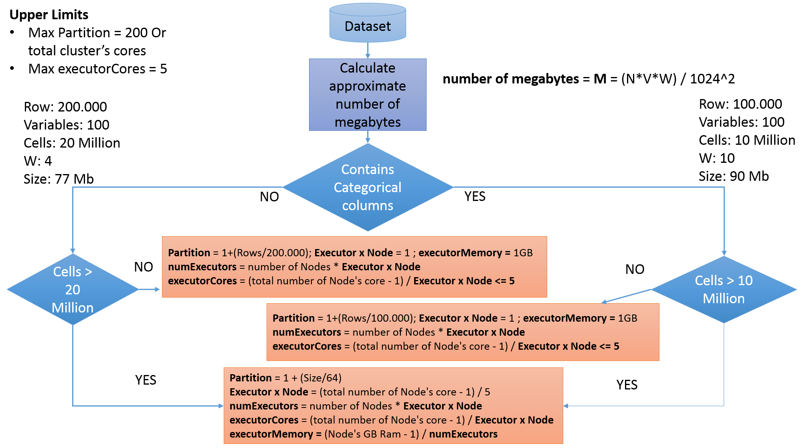

# How to estimate the number of partitions, executor's and driver's params \(YARN Cluster Mode\)

```text
yarn.nodemanager.resource.memory-mb = ((Node's Ram GB - 2 GB) * 1024) MB
```

```text
Total Number Of Node's Core = yarn.nodemanager.resource.cpu-vcores
```

**-** **Executor's params \(Worker Node\):**

* `Executor (VM) x Node = ((total number of Node's core) / 5) - 1`
  * 5 is the upper bound for cores per executor because more than 5 cores per executor can degrade HDFS I/O throughput.
  * If the total number of Node's core is less than or equal to 8 we divide It by 2.
  * If the total number of Node's core is equal to 1 the Executor x Node is equal to 1.
* `numExecutors (Number of executorns to launch for this session) = number of Nodes * Executor (VM) x Node`
  * The Driver is included in executors.
* `executorCores (Number of cores to use for each executor) = (total number of Node's core - 5 ) / Executor x Node`
* `executorMemory (Amount of memory to use per executor process) = (yarn.nodemanager.resource.memory-mb - 1024) / (Executor (VM) x Node + 1)`

For the **executorMemory** We have to take a further reasoning. If you review the **BlockManager** source code: [./core/src/main/scala/org/apache/spark/storage/BlockManager.scala](https://github.com/apache/spark/blob/master/core/src/main/scala/org/apache/spark/storage/BlockManager.scala)

You will note that the memory allocation is based on the algorithm:

`Runtime.getRuntime.maxMemory * memoryFraction * safetyFraction.`

where **memoryFraction = spark.storage.memoryFraction** and **safetyFraction = spark.storage.safetyFraction**

The default values of **spark.storage.memoryFraction** and **spark.storage.safetyFraction** are respectively **0.6** and **0.9** so the real **executorMemory** is:

`executorMemory = ((yarn.nodemanager.resource.memory-mb - 1024) / (Executor (VM) x Node + 1)) * memoryFraction * safetyFraction.`

**- Driver's params \(Application Master Node\):**

* `driverCores = executorCores`
* `driverMemory = executorMemory`

**Example**

I have 3 Worker nodes and one Application Master Node each with **16 vCPUs, 52 GB memory**

`yarn.nodemanager.resource.memory-mb = (52 - 2) * 1024 = 51200 MB`

`yarn.scheduler.maximum-allocation-mb = 20830 MB (Must be greater than executorMemory)`

**-** Executor's params \(Worker Node\):

* `Executor x Node = (16) / 5 = 2`
* `numExecutors = 2 * 4 = 8`
* `executorCores = (16 - 5) / 2 = 5`
* `executorMemory = ((51200 - 1024) / 3) * 0.6 * 0.9 = 16725,33 MB * 0.6 * 0.9 = 9031,68 MB`

**-** Driver's params \(Application Master Node\):

* `driverCores = 5`
* `driverMemory = 16725,33 MB * 0.6 * 0.9 = 9031,68 MB`

See in the diagram how params are estimated:



I have to process a dataset that has 10.000.000 of rows and 100 double variables.

```text
number of megabytes  =  M  =  10.000.000*100*8/1024^2 =  5.722 megabytes
```

`Partition = 5.722/64 = 89`

As in the previous example, I have 3 **Worker** nodes and one **Application Master** Node each with **16 vCPUs, 52 GB memory**

`yarn.nodemanager.resource.memory-mb = (52 - 2) * 1024 = 51200 MB`

`yarn.scheduler.maximum-allocation-mb = 20830 MB (Must be greater than executorMemory)`

**-** Executor's params \(Worker Node\):

* `Executor x Node = ((16) / 5) - 1 = 2`
* `numExecutors = 2 * 4 = 8`
* `executorCores = (16 - 5) / 2 = 5`
* `executorMemory = ((51200 - 1024) / 3) * 0.6 * 0.9 = 16725,33 MB * 0.6 * 0.9 = 9031,68 MB`

**-** Driver's params \(Application Master Node\):

* `driverCores = 5`
* `driverMemory = 16725,33 MB * 0.6 * 0.9 = 9031,68 MB`

