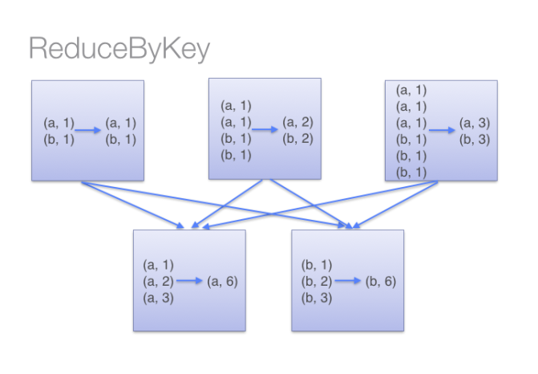
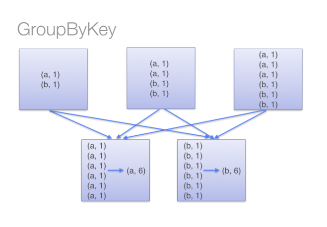

# Avoid groupByKey when performing an associative reductive operation

For example, `rdd.groupByKey().mapValues(_.sum)` will produce the same results as `rdd.reduceByKey(_ + _)`. However, the former will transfer the entire dataset across the network, while the latter will compute local sums for each key in each partition and combine those local sums into larger sums after shuffling.

As already showed in [\[2\]](https://databricks.gitbooks.io/databricks-spark-knowledge-base/content/best_practices/prefer_reducebykey_over_groupbykey.html) let see example of word count you can process RDD and find the frequency of word using both the transformations `groupByKey`and `reduceBykey`.

word count using `reduceBykey`:

```scala
val wordPairsRDD = rdd.map(word => (word, 1))
val wordCountsWithReduce = wordPairsRDD
  .reduceByKey(_ + _)
  .collect()
```

See in diagram how RDD are process and shuffle over the network  
  
As you see in above diagram all worker node first process its own partition and count words on its own machine and then shuffle for final result.



On the other hand if we use `groupByKey`for word count as follow:

```scala
val wordCountsWithGroup = rdd
  .groupByKey()
  .map(t => (t._1, t._2.sum))
  .collect()
```

Let see diagram how RDD are process and shuffle over the network using **groupByKey**  
  
As you see above all worker node shuffle data and at final node it will be count words so using `groupByKey`so lot of unnecessary data will be transfer over the network.



So avoid using `groupByKey`as much as possible.

