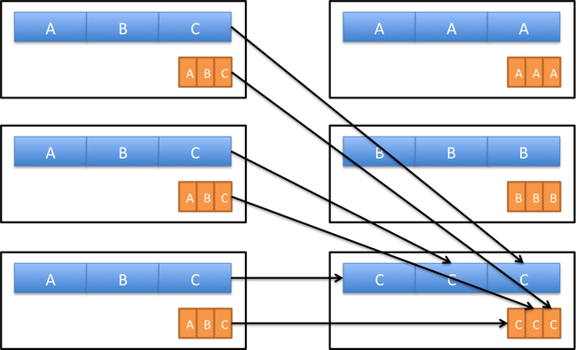

# Hash-partition before transformation over pair RDD

Before perform any transformation we should shuffle same key data at the same worker so for that we use Hash-partition to shuffle data and make partition using the key of the pair RDD let see the example of the Hash-Partition data

```scala
val wordPairsRDD = rdd.map(word => (word, 1)).
                   partitonBy(new HashPartition(4))

val wordCountsWithReduce = wordPairsRDD
  .reduceByKey(_ + _)
  .collect()
```

When we are using Hash-partition the data will be shuffle and all same key data will shuffle at same worker, Let see in diagram



In the above diagram you can see all the data of “c” key will be shuffle at sameworker node. So if we use tansformation over pair RDD we should use hash-partitioning.

