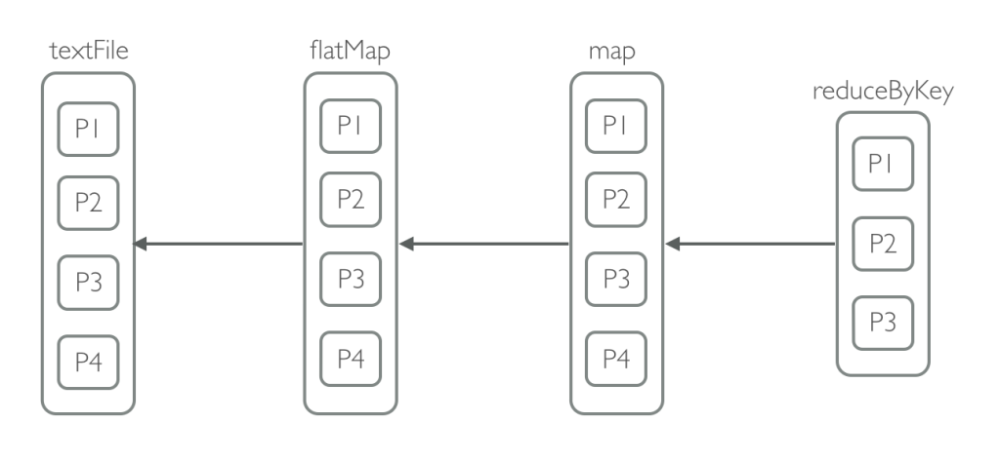
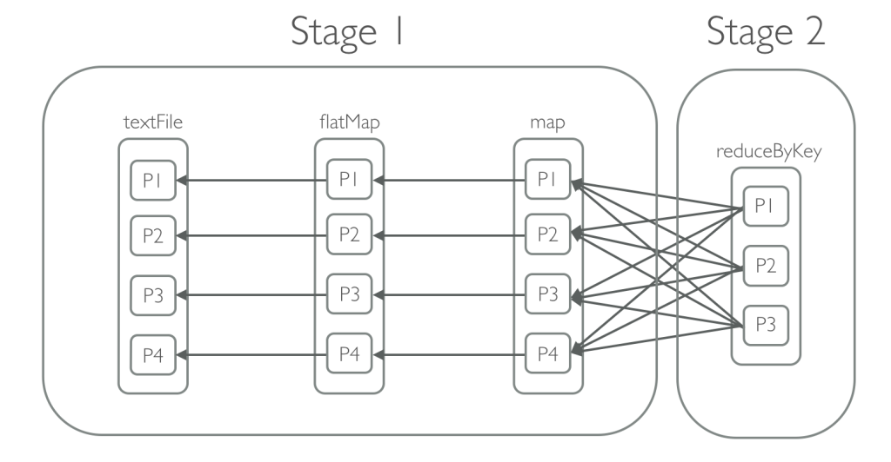
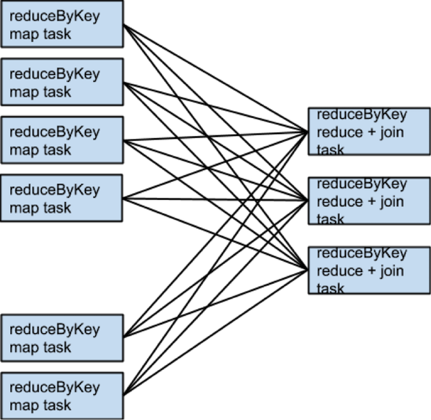

# Avoiding Shuffle "Less stage, run faster"

## Introduction to shuffling

Let’s start by taking our good old word-count friend as starting example:

```scala
rdd = sc.textFile("input.txt")\
.flatMap(lambda line: line.split())\
.map(lambda word: (word, 1))\
.reduceByKey(lambda x, y: x + y, 3)\
.collect()
```

RDD operations are compiled into a **Direct Acyclic Graph** of RDD objects, where each RDD points to the parent it depends on:  




At shuffle boundaries, the DAG is partitioned into so-called stages that are going to be executed in order, as shown in next figure. The shuffle is Spark’s mechanism for re-distributing data so that it’s grouped differently across partitions. This typically involves copying data across executors and machines, making the shuffle a complex and costly operation.



Stages, tasks and shuffle writes and reads are concrete concepts that can be monitored from the Spark shell. The shell can be accessed from the driver node on port 4040.

## When Shuffles Don’t Happen

It’s also useful to be aware of the cases in which the above transformations will not result in shuffles. Spark knows to avoid a shuffle when a previous transformation has already partitioned the data according to the same partitioner. Consider the following flow:

```scala
rdd1 = someRdd.reduceByKey(...)
rdd2 = someOtherRdd.reduceByKey(...)
rdd3 = rdd1.join(rdd2)
```

Because no partitioner is passed to `reduceByKey`, the default partitioner will be used, resulting in rdd1 and rdd2 both hash-partitioned. These two `reduceByKeys`will result in two shuffles. If the RDDs have the same number of partitions, the join will require no additional shuffling. Because the RDDs are partitioned identically, the set of keys in any single partition of rdd1 can only show up in a single partition of rdd2. Therefore, the contents of any single output partition of rdd3 will depend only on the contents of a single partition in rdd1 and single partition in rdd2, and a third shuffle is not required.

For example, if some Rdd has four partitions, someOther Rdd has two partitions, and both the `reduceByKeys`use three partitions, the set of tasks that execute would look like:



What if rdd1 and rdd2 use different partitioners or use the default \(hash\) partitioner with different numbers partitions? In that case, only one of the rdds \(the one with the fewer number of partitions\) will need to be reshuffled for the join.

Same transformations, same inputs, different number of partitions:


One way to avoid shuffles when joining two datasets is to take advantage of broadcast variables. When one of the datasets is small enough to fit in memory in a single executor, it can be loaded into a hash table on the driver and then broadcast to every executor. A map transformation can then reference the hash table to do lookups.

## Best Practices

In general, avoiding shuffle will make your program run faster. All shuffle data must be written to disk and then transferred over the network.  
Each time that you generate a shuffling shall be generated a new stage. So between a stage and another one I have a shuffling.

1. **repartition**, **join**, **cogroup**, and any of the **\*By** or **\*ByKey** transformations can result in shuffles.
2. **map**, **filter** and **union** generate a only stage \(no shuffling\).
3. Use the built in **aggregateByKey\(\)** operator instead of writing your own aggregations.
4. Filter input earlier in the program rather than later.

## When More Shuffles are Better

There is an occasional exception to the rule of minimizing the number of shuffles. An extra shuffle can be advantageous to performance when it increases parallelism. For example, if your data arrives in a few large unsplittable files, the partitioning dictated by the InputFormat might place large numbers of records in each partition, while not generating enough partitions to take advantage of all the available cores. In this case, invoking repartition with a high number of partitions \(which will trigger a shuffle\) after loading the data will allow the operations that come after it to leverage more of the cluster’s CPU.

Another instance of this exception can arise when using the reduce or aggregate action to aggregate data into the driver. When aggregating over a high number of partitions, the computation can quickly become **bottlenecked** on a single thread in the driver merging all the results together. To loosen the load on the driver, one can first use **reduceByKey** or **aggregateByKey** to carry out a round of distributed aggregation that divides the dataset into a smaller number of partitions. The values within each partition are merged with each other in parallel, before sending their results to the driver for a final round of aggregation. Take a look at **treeReduce** and **treeAggregate** for examples of how to do that. \(Note that in 1.2, the most recent version at the time of this writing, these are marked as developer APIs, but **SPARK-5430** seeks to add stable versions of them in core.\)

This trick is especially useful when the aggregation is already grouped by a key. For example, consider an app that wants to count the occurrences of each word in a corpus and pull the results into the driver as a map. One approach, which can be accomplished with the aggregate action, is to compute a local map at each partition and then merge the maps at the driver. The alternative approach, which can be accomplished with **aggregateByKey**, is to perform the count in a fully distributed way, and then simply **collectAsMap** the results to the driver.

