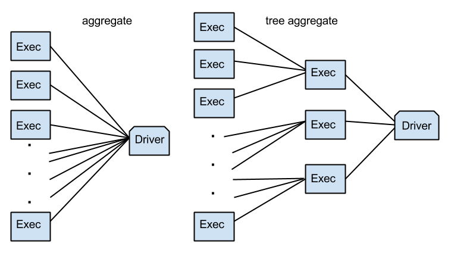

# TreeReduce and TreeAggregate Demystified

## Introduction

In a regular **reduce** or **aggregate** functions in Spark \(and the original MapReduce\) all partitions have to send their reduced value to the driver machine, and that machine spends linear time on the number of partitions \(due to the CPU cost in merging partial results and the network bandwidth limit\). It becomes a **bottleneck** \[13\] ****when there are many partitions and the data from each partition is big.

Since [Spark 1.1](https://databricks.com/blog/2014/09/22/spark-1-1-mllib-performance-improvements.html) \[20\] was introduced a new aggregation communication pattern based on multi-level aggregation trees. In this setup, data are combined partially on a small set of executors before they are sent to the driver, which dramatically reduces the load the driver has to deal with. Tests showed that these functions reduce the aggregation time by an order of magnitude, especially on datasets with a large number of partitions.

So, in **treeReduce** and in **treeAggregate**, the partitions talk to each other in a logarithmic number of rounds.

In case of **treeAggregate** imagine the follow n-ary tree that has all the partitions at its leaves and the root will contain the final reduced value. This way there is no single bottleneck machine.



## Differences between reduceByKey and treeReduce

**reduceByKey** is only available on key-value pair RDDs, while [**treeReduce** ](https://github.com/apache/spark/blob/master/core/src/main/scala/org/apache/spark/rdd/RDD.scala)is a generalization of reduce operation on any RDD. **reduceByKey** is used for implementing **treeReduce** but they are not related in any other sense. **reduceByKey** performs reduction for each key, resulting in an RDD; it is not an action but a transformation that returns a Shuffled RDD.  
On the other hand, **treeReduce** perform the reduction in parallel using **reduceByKey** \(this is done by creating a key-value pair RDD on the fly, with the keys determined by the depth of the tree\).

## Differences between aggregate and treeAggregate

[**treeAggregate**](https://github.com/apache/spark/blob/master/core/src/main/scala/org/apache/spark/rdd/RDD.scala) \[19\] is ****a specialized implementation of **aggregate** that iteratively applies the combine function to a subset of partitions. This is done in order to prevent returning all partial results to the driver where a single pass reduce would take place as the classic **aggregate** does.

## Why you should use TreeReduce/TreeAggregate

Many of **MLib**'s algorithms uses **treeAggregate**, in the case of **GaussianMixture** \([https://tinyurl.com/n3l68a8](https://tinyurl.com/n3l68a8)\) the use of **treeAggregate** rather than **aggregate** have increased the performance about **20%**, while **Online Variational Bayes for LDA** \([https://tinyurl.com/kt6kty6](https://tinyurl.com/kt6kty6)\) uses a **treeAggregate** instead of a **reduce** to aggregate the expected word-topic count matrix \(potentially a very large matrix\) without scalability issues. Also **MLlib**'s implementation of **Gradient Descent** use **treeAggregate** \([https://tinyurl.com/l6q5nn7](https://tinyurl.com/l6q5nn7)\).

In fact curious about this I've decided to use **treeAggregate** instead of a **reduce** to compute **Gradient** in my implementation of **Back Propagation**. In my test of dataset with 100 features and 10M instance partitioned in 96 partitions, performed on a cluster consists of 3 Worker nodes and one Application Master node \(each with 16 CPUs and 52 GB memory\), the **neural network** performed 100 epochs in only 36 minutes instead of hours.

## Code examples \(Scala\)

The follow **Scala** code generates two random double **RDD** that contains **1 million values** and calculates the **Euclidean distance** using **map-reduce pattern**, **treeReduce** and **treeAggregate**:

```scala
import org.apache.commons.lang.SystemUtils
import org.apache.spark.mllib.random.RandomRDDs._
import org.apache.spark.sql.SQLContext
import org.apache.spark.{SparkConf, SparkContext}

import scala.math.sqrt

object Test{

  def main(args: Array[String]) {

    var mapReduceTimeArr : Array[Double]= Array.ofDim(20)
    var treeReduceTimeArr : Array[Double]= Array.ofDim(20)
    var treeAggregateTimeArr : Array[Double]= Array.ofDim(20)

    // Spark setup
    val config = new SparkConf().setAppName("TestStack")
    val sc: SparkContext = new SparkContext(config)
    val sql: SQLContext = new SQLContext(sc)

    // Generate a random double RDD that contains 1 million i.i.d. values drawn from the
    // standard normal distribution `N(0, 1)`, evenly distributed in 5 partitions.
    val input1 = normalRDD(sc, 1000000L, 5)

    // Generate a random double RDD that contains 1 million i.i.d. values drawn from the
    // standard normal distribution `N(0, 1)`, evenly distributed in 5 partitions.
    val input2 = normalRDD(sc, 1000000L, 5)

    val xy = input1.zip(input2).cache()
    // To materialize th RDD
    xy.count()

    for(i:Int <-0 until 20){
      val t1 = System.nanoTime()
      val euclideanDistanceMapRed = sqrt(xy.map { case (v1, v2) => (v1 - v2) * (v1 - v2) }.reduce(_ + _))
      val t11 = System.nanoTime()
      println("Map-Reduce - Euclidean Distance "+euclideanDistanceMapRed)
      mapReduceTimeArr(i)=(t11 - t1)/1000000.0
      println("Map-Reduce - Elapsed time: " + (t11 - t1)/1000000.0  + "ms")
    }

    for(i:Int <-0 until 20) {
      val t2 = System.nanoTime()
      val euclideanDistanceTreeRed = sqrt(xy.map { case (v1, v2) => (v1 - v2) * (v1 - v2) }.treeReduce(_ + _))
      val t22 = System.nanoTime()
      println("TreeReduce - Euclidean Distance "+euclideanDistanceTreeRed)
      treeReduceTimeArr(i)=(t22 - t2) / 1000000.0
      println("TreeReduce - Elapsed time: " + (t22 - t2) / 1000000.0 + "ms")
    }

    for(i:Int <-0 until 20) {
      val t3 = System.nanoTime()
      val euclideanDistanceTreeAggr = sqrt(xy.treeAggregate(0.0)(
        seqOp = (c, v) => {
          (c + ((v._1 - v._2) * (v._1 - v._2)))
        },
        combOp = (c1, c2) => {
          (c1 + c2)
        }))
      val t33 = System.nanoTime()
      println("TreeAggregate - Euclidean Distance " + euclideanDistanceTreeAggr)
      treeAggregateTimeArr(i) = (t33 - t3) / 1000000.0
      println("TreeAggregate - Elapsed time: " + (t33 - t3) / 1000000.0 + "ms")
    }

    val mapReduceAvgTime = mapReduceTimeArr.sum / mapReduceTimeArr.length
    val treeReduceAvgTime = treeReduceTimeArr.sum / treeReduceTimeArr.length
    val treeAggregateAvgTime = treeAggregateTimeArr.sum / treeAggregateTimeArr.length

    val mapReduceMinTime = mapReduceTimeArr.min
    val treeReduceMinTime = treeReduceTimeArr.min
    val treeAggregateMinTime = treeAggregateTimeArr.min

    val mapReduceMaxTime = mapReduceTimeArr.max
    val treeReduceMaxTime = treeReduceTimeArr.max
    val treeAggregateMaxTime = treeAggregateTimeArr.max

    println("Map-Reduce - Avg:" + mapReduceAvgTime+ "ms "+ "Max:" +mapReduceMaxTime+ "ms "+ "Min:" +mapReduceMinTime+ "ms ")
    println("TreeReduce - Avg:" + treeReduceAvgTime + "ms "+ "Max:" +treeReduceMaxTime+ "ms "+ "Min:" +treeReduceMinTime+ "ms ")
    println("TreeAggregate - Avg:" + treeAggregateAvgTime + "ms "+ "Max:" +treeAggregateMaxTime+ "ms "+ "Min:" +treeAggregateMinTime+ "ms ")
  }
}
```

To see **treeReduce/treeAggregate** shine, this code should be run on a cluster with a large number of partitions.

## Code examples \(Java\)

### Basic Java treeReduce and treeAggregate examples

```java
public void treeReduce() {
   JavaRDD<Integer> rdd = sc.parallelize(Arrays.asList(-5, -4, -3, -2, -1, 1, 2, 3, 4), 10);
     Function2<Integer, Integer, Integer> add = new Function2<Integer, Integer, Integer>() {
       @Override
       public Integer call(Integer a, Integer b) {
         return a + b;
       }
     };
     for (int depth = 1; depth <= 10; depth++) {
       int sum = rdd.treeReduce(add, depth);
       assertEquals(-5, sum);
     }
   }


public void treeAggregate() {
     JavaRDD<Integer> rdd = sc.parallelize(Arrays.asList(-5, -4, -3, -2, -1, 1, 2, 3, 4), 10);
     Function2<Integer, Integer, Integer> add = new Function2<Integer, Integer, Integer>() {
       @Override
       public Integer call(Integer a, Integer b) {
         return a + b;
       }
     };
     for (int depth = 1; depth <= 10; depth++) {
       int sum = rdd.treeAggregate(0, add, add, depth);
       assertEquals(-5, sum);
     }
   }
```

