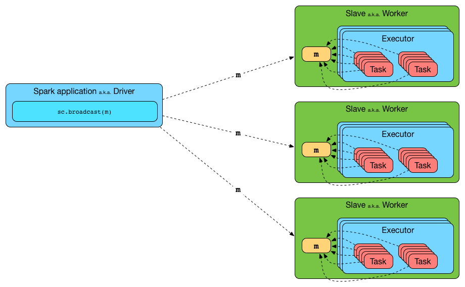

# When to use Broadcast variable

As documentation for [Spark Broadcast variables](http://spark.apache.org/docs/latest/programming-guide.html#broadcast-variables) states, they are immutable shared variable which are cached on each worker nodes on a Spark cluster.  




## When to use Broadcast variable?

Before running each tasks on the available executors, Spark computes the task’s closure. The closure is those variables and methods which must be visible for the executor to perform its computations on the RDD.

If you have huge array that is accessed from Spark Closures, for example some reference data, this array will be shipped to each spark node with closure.  
For example if you have 10 nodes cluster with 100 partitions \(10 partitions per node\), this Array will be distributed at least 100 times \(10 times to each node\).  
If you use broadcast it will be distributed once per node using efficient p2p protocol.

```scala
val array: Array[Int] = ??? // some huge array
val broadcasted = sc.broadcast(array)
```

And some RDD

```scala
val rdd: RDD[Int] = ???
```

In this case array will be shipped with closure each time

```scala
rdd.map(i => array.contains(i))
```

and with broadcast you'll get huge performance benefit

```scala
rdd.map(i => broadcasted.value.contains(i))
```

## Things to remember while using Broadcast variables:

Once we broadcasted the value to the nodes, we shouldn’t make changes to its value to make sure each node have exact same copy of data. The modified value might be sent to another node later that would give unexpected results.

